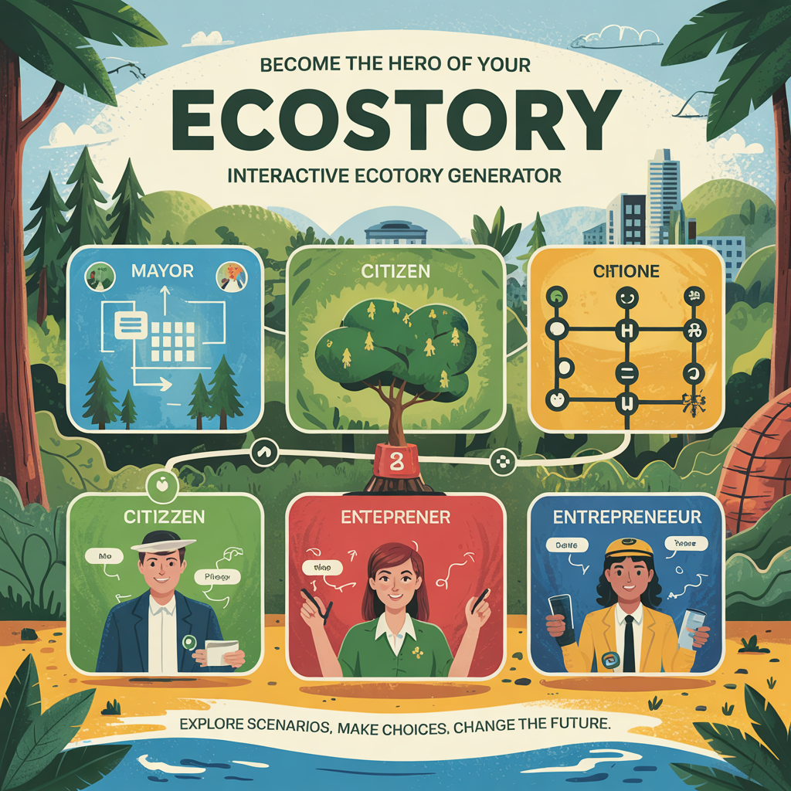
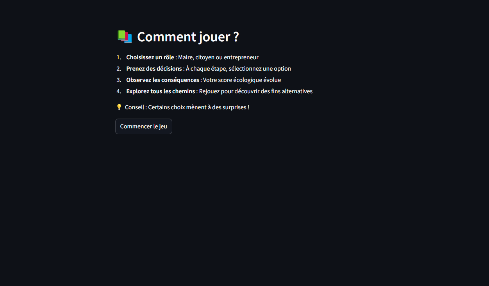
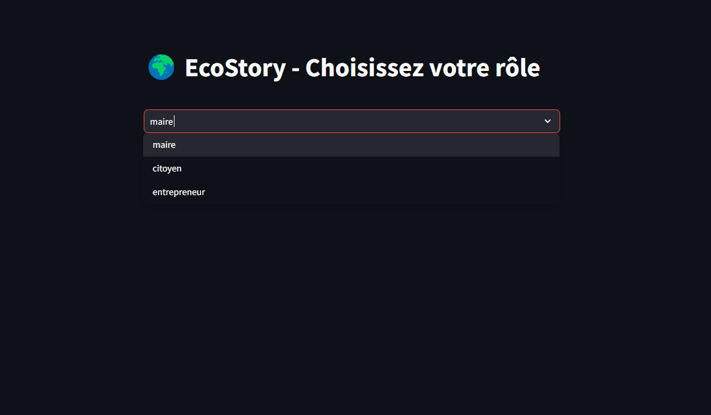
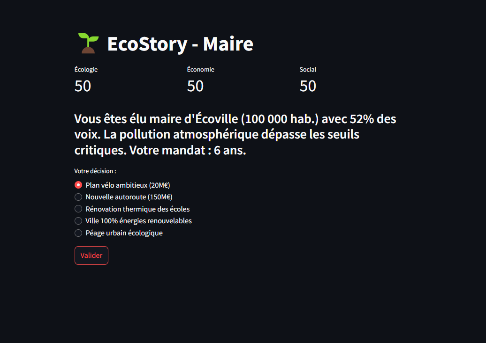
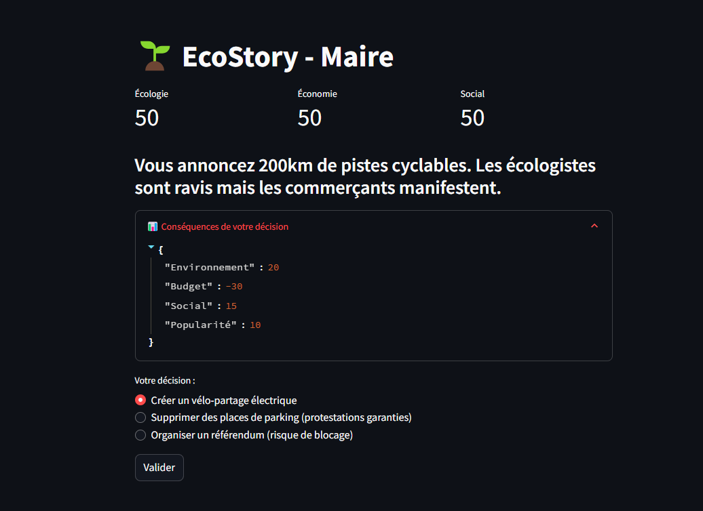

# EcoStory - Générateur d'Histoires Écologiques Interactives


## Membre de l'équipe
- Charmeel VODOUHE
- Rochdyath BACHABI
- Aman MENDA
- Hanim MOUSSA YARI
- Linerol TCHECOUNNOU
- Imdad ADELABOU

## 🌍 Description
EcoStory est une application web interactive qui permet aux utilisateurs d'explorer différents scénarios écologiques à travers des histoires dont ils sont les héros. Chaque choix influence l'environnement et le déroulement de l'aventure.

## ✨ Fonctionnalités

Voici l'interface principale :


> *Page Comment Jouer *


> *Page Choisir votre rôle *


> *Page Story Choix *


> *Page Story Choix + conséquence *

- 3 rôles jouables : Maire, Citoyen, Entrepreneur
- 15+ fins alternatives pour chaque scénario
- Système de conséquences environnementales
- Arbres décisionnels complets
- Interface simple et intuitive

## 🛠️ Technologies
- Python 3.9+
- Streamlit (interface web)
- GitHub Pages (hébergement)

## 🚀 Installation locale
1. Clonez le dépôt :
```
git clone https://github.com/LFlem/EcoStory.git
cd EcoStory
```
2. Installez les dépendances :
```
pip install -r requirements.txt
```
3. Lien de l'application :
https://ecostory-app.streamlit.app/

## 🌐 Déploiement en ligne
1. Via Streamlit Cloud (recommandé) :
   - Connectez votre compte GitHub
   - Sélectionnez ce dépôt
   - Cliquez sur "Deploy"

2. Via GitHub Pages :
   - Activez GitHub Pages dans les paramètres du dépôt
   - Le site sera disponible à : `votre-pseudo.github.io/ecostory`

## 📂 Structure des fichiers
```
ecostory/
├── app.py # Application principale
├── arbre_decisionnel.py # Tous les scénarios et choix
├── requirements.txt # Dépendances
├── assets/ # Ressources
│ ├── images/ # Illustrations
│ └── style.css # Feuille de style
└── README.md # Ce fichier
```

## 🤝 Contribution
Les contributions sont les bienvenues ! Suivez ces étapes :
1. Forkez le projet
2. Créez une branche (`git checkout -b feature/ma-contribution`)
3. Committez vos changements (`git commit -m 'Ajout d'un nouveau scénario'`)
4. Pushez (`git push origin feature/ma-contribution`)
5. Ouvrez une Pull Request

## 🔍 Réflexivité du projet

### 🌱 Idée originale
Le sujet écologique a été choisi pour :
- Sensibiliser aux enjeux environnementaux de façon ludique
- Illustrer l'interconnexion des décisions individuelles et collectives
- Proposer une alternative engageante aux contenus éducatifs traditionnels

### 🧠 Outils IA utilisés
- **GPT-4** : Génération dynamique des histoires et conséquences
- **Streamlit** : Création rapide d'une interface interactive sans frontend complexe
- **GitHub Copilot** : Accélération du développement des arbres décisionnels

### 🧗 Défis rencontrés
1. **Complexité des scénarios** :
   - Solution : Structuration modulaire des arbres décisionnels
   - Outil : Création d'un système de tags pour suivre les variables d'état

2. **Équilibrage des conséquences** :
   - Solution : Matrice d'impacts normalisée (-10 à +10)
   - Méthode : Tests itératifs avec des bêta-testeurs

### 📊 Bilan du projet
**Ce qui a fonctionné** :
- Immersion réussie grâce aux scénarios réalistes
- Feedback positif sur l'aspect éducatif ludique
- Facilité de déploiement avec Streamlit

**Améliorations possibles** :
- Ajout de visualisations graphiques des impacts
- Système de sauvegarde des parties
- Version multijoueur avec comparaison des choix
-Ajout d'une api pour la generation de scénario

## 📜 Licence
Ce projet est sous licence MIT - voir le fichier [LICENSE](LICENSE) pour plus de détails.

## 📞 Contact
Pour toute question : mousshanim12@gmail.com